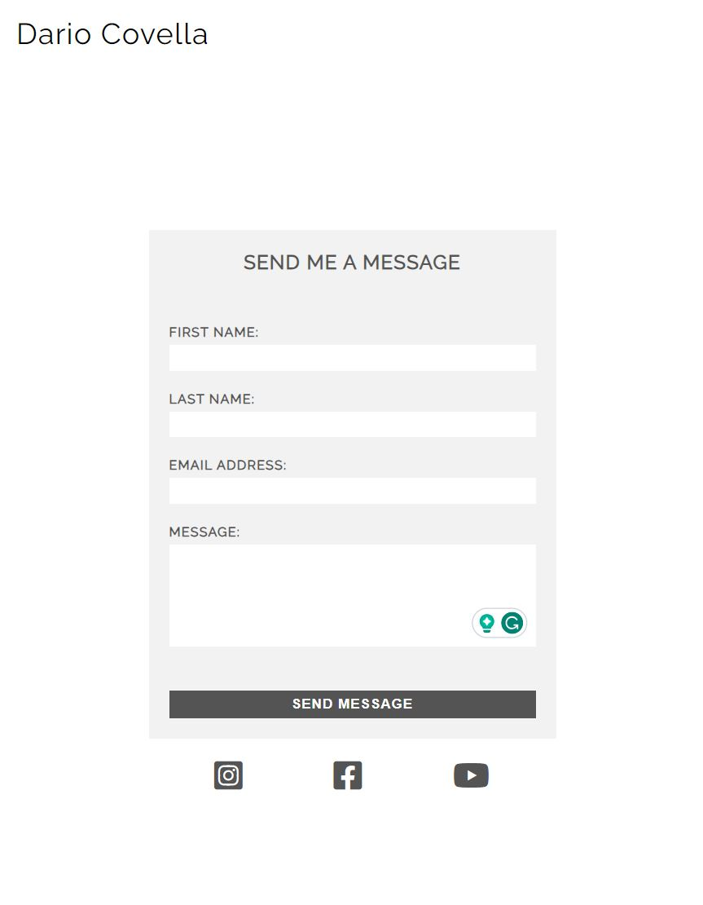

# Portfolio Project 1 - HTML/CSS Essentials <!-- omit in toc -->

## DC Architecture Portfolio <!-- omit in toc -->

## Live Site <!-- omit in toc -->

[Dario Covella - Architecture Portfolio](https://darioc18.github.io/architecture-portfolio/architecture.html)

## Repository <!-- omit in toc -->

[https://github.com/Darioc18/architecture-portfolio](https://github.com/Darioc18/architecture-portfolio)

## Table of Contents <!-- omit in toc -->

- [Brief](#brief)
- [Goal](#goal)
- [User Experience UX](#user-experience-ux)
  - [User stories](#user-stories)
- [Design](#design)
  - [Wireframes](#wireframes)
  - [Colours](#colours)
  - [Typography](#typography)
  - [Imagery](#imagery)
- [Features](#features)
  - [Existing Features](#existing-features)
  - [Features left to implement](#features-left-to-implement)
- [Testing](#testing)
  - [Validator testing](#validator-testing)
  - [Bugs](#bugs)
  - [Performance](#performance)
  - [Accessibility](#accessibility)
- [Technologies Used](#technologies-used)
- [Deployment](#deployment)
- [Credits](#credits)
- [Aknowledgments](#aknowledgments)

## Brief

This website showcases a collection of projects I have worked on, demonstrating my passion and expertise in the field of architecture. Explore the diverse range of designs and concepts that have shaped my career, from residential and commercial spaces to urban planning and beyond. Gain insights into my creative process, attention to detail, and commitment to delivering bespoke architectural solutions

## Goal

The primary goal of creating this website is to showcase my architecture portfolio, featuring the projects I have worked on. By presenting my professional accomplishments and showcasing my design skills, I aim to:

- Provide potential clients, employers, and collaborators with a comprehensive overview of my architectural expertise;
- Include information about me, allowing visitors to gain insights into my background, qualifications, and design philosophy;
- Include a contact section to enable interested parties to reach out to me directly, providing a platform for communication and potential opportunities.

Overall, this website would serve as a dynamic platform to exhibit personal architectural achievements, establish a professional online presence, and foster connections within the industry.

It is important to note that this portfolio is not intended for professional use; rather, it serves as a showcase to highlight my skills and competence with CSS and HTML.

## User Experience UX

The three main features of the architecture portfolio website:

- **architecture**: a curated collection of projects, showcasing my architectural work, design concepts, and innovative solutions.
- **info**: learn more about me as an architect through a dedicated page that provides a brief description of my background, qualifications, and experience. This page may also include a curated CV or additional information to provide insights into my expertise.
- **contact**: connect with me easily through a dedicated contact section, allowing visitors to send messages, inquiries, or collaboration requests. This section enables direct communication and fosters opportunities for professional engagement.

### User stories

- #### As a Target User, I want

  - To easily find information about the architect's experience, qualifications, and relevant certifications to assess their expertise and credibility;
  - The website to showcase a diverse range of project types (residential, commercial, etc.) to gauge the architect's versatility and adaptability;
  - To highlight any collaborative efforts or notable partnerships the architect has engaged in, demonstrating their ability to work effectively with a team;
  - The website to provide a gallery or portfolio section showcasing high-quality images that highlight the architect's attention to detail and craftsmanship;
  - The website to offer a way to easily request additional information or schedule a meeting with the architect to discuss specific project needs.

- #### As a First-Time User, I want

  - To easily navigate the website to understand its purpose and content quickly;
  - To be able to view the site on wide range of devices;
  - To explore the projects in the architecture portfolio and view detailed information about each project;
  - To learn more about the architect by accessing their profile or bio section;
  - To have a clear understanding of how to contact the architect through the website's contact section;
  - The website to provide a visually appealing and intuitive interface that encourages further exploration.

- #### As a Returning User, I want

  - The website to provide regular updates on new projects or achievements by the architect.
  - To have a seamless experience when contacting the architect through the website, ensuring my message reaches them successfully.

## Design

In designing this website, my intention was to keep the colors and layout minimalistic. This approach allows the projects showcased in the portfolio to take center stage, each having its unique style and color palette. By adopting a simple design, the goal is to create a visual environment where the projects can truly stand out and captivate the viewer's attention.

### Wireframes

Displayed below are a set of wireframes illustrating the various pages of the portfolio. The elements in red indicate some specific features that I intend to incorporate in future revisions.

### Colours

In line with the principle mentioned above, I aimed to adhere to a minimalistic color palette, consisting of black, white, and two distinct shades of grey. This deliberate choice allows for a clean and understated aesthetic, ensuring that the focus remains on the projects themselves while maintaining a cohesive and visually appealing design. I created a visual palette by using [coolors.co](https://coolors.co).

### Typography

In order to maintain a clean aesthetic, I opted to utilize a single font imported from [Google Fonts](https://fonts.google.com/): [Raleway](https://fonts.google.com/specimen/Raleway). This font choice complements the overall design by providing a clean and elegant typography style that enhances the readability and visual consistency of the website.

### Imagery

As the central focus of the website, Dario's personal portfolio will prominently feature imagery. To optimize the loading times, many of the images, which are typically large files, will be compressed. By using a compression tool [compressjpeg.com](https://compressjpeg.com/), the images will be resized and optimized without compromising their quality.
For the home page, I selected a visually pleasing image with neutral and clear colors to align with the minimalistic character of the entire website. The arrangement of the images will be thoughtfully organized to showcase a variety of projects effectively, allowing visitors to explore and appreciate Dario's diverse body of work.
The images within the portfolio were created utilizing a diverse range of architectural and design software.

## Features

### Existing Features

- #### Home Page

  - The home page of the website follows a minimalistic design, featuring only a name and a hero image. Upon clicking the name, a smooth transition occurs where the navigation bar appears, and the hero image gracefully disappears. This transition creates a seamless user experience, allowing the navigation bar to show up.
  - Once the navigation bar is visible, a white canvas is revealed, providing a clean backdrop for the display of projects. By clicking on the _architecture_ option, the projects related to architecture will be showcased on this white canvas. This approach ensures a focused and uncluttered presentation, allowing visitors to explore your architectural projects without any distractions.

    

- #### Navigation bar

  - Featured on all three pages, the full responsive navigation bar includes links to the Gallery (_architecture_), _info_, _contact_, and _home_ page and is identical in each page to allow for easy navigation.
  - This section will allow the user to easily navigate from page to page across all devices without having to revert back to the previous page via the ‘back’ button;
  - For screens larger than 920px, the navigation bar is designed to have no solid background. This intentional choice allows the images to scroll freely without being obstructed by a solid header.

    

  - On screens smaller than 920px, a white background is applied to the navigation bar. This adjustment is made to prevent any clashes between the scrolling images and the navigation bar items. However, on the home page, the navigation bar is intentionally designed withn no solid background. This decision ensures that the hero image can span the entire screen size, creating a visually impactful impression and allowing the image to be fully visible even on smaller screens.

    

- #### Architecture Gallery

  - The _architecture_ page serves as a platform for users to explore the designer's work, which is presented through a series of boxes. Initially no text is displayed maintaining a clean appearance. However, upon hovering over each box, the name of the project elegantly fades in, providing additional information and context for the user. This interactive feature enhances the user experience by enabling them to discover the project names and engage more deeply with the designer's portfolio.

    

  - On smaller screens, the website's responsive design ensures optimal user experience by adapting the layout of the _architecture_ page. Specifically, the boxes containing project information are designed to stack on top of each other, creating a vertical arrangement. This stacking arrangement allows for easy scrolling and improved readability on smaller screens, ensuring that users can comfortably explore the projects even with limited screen space. By adapting to different screen sizes, the responsive design provides a seamless and user-friendly browsing experience across a range of devices.
  - On screens smaller than 920px, a white background is applied to the navigation bar.

    

- #### Info Page

  - The info page provides a brief introduction of myself, showcasing my achievements and my experiences and showing a picture of me.

    

  - The info page is fully responsive, with the text and picture stacking on smaller screens for optimal viewing.

    

- #### Contact Page

  - The contact page provides users with the ability to easily get in touch with the artist for various purposes, such as project inquiries or sharing opinions about previous work.
  - All fields in the contact form are set as required. This means that the form cannot be submitted unless all necessary information, including names, message and valid email addresses, are provided.

    

### Features left to implement

- Expand the _architecture_ page: add more projects to showcase a wider range of the designer's work.
- Individual project pages with navigation arrows: implement the feature depicted in the [Wireframes](#wireframes), allowing users to navigate between individual project pages using arrows. These arrows should be placed in a way that allows users to easily move to the next or previous project. Additionally, consider including a small preview of the upcoming or previous project above the arrows, providing a glimpse of what's to come.

## Testing

Testing has been conducted on multiple browsers, including Chrome, Firefox, and Edge, ensuring that the website appears and functions as intended in each of them. Additionally, the responsive design has been tested using the developer tools option, ensuring that the website dynamically adjusts and adapts across various screen sizes. Furthermore, to guarantee a consistent user experience, the website has been tested on a mobile device.

### Validator testing

Each page has been run through the W3C Markup validation service and CSS validation service:

- HTML
  - No errors were returned when passing through the official [W3C validator](https://validator.w3.org/nu/?doc=https%3A%2F%2Fdarioc18.github.io%2Farchitecture-portfolio%2F)
    - homepage [W3C validation](https://validator.w3.org/nu/?doc=https%3A%2F%2Fdarioc18.github.io%2Farchitecture-portfolio%2F)
    - _architecture_ page [W3C validation](https://validator.w3.org/nu/?doc=https%3A%2F%2Fdarioc18.github.io%2Farchitecture-portfolio%2Farchitecture.html)
    - _contact_ page [W3C validation](https://validator.w3.org/nu/?doc=https%3A%2F%2Fdarioc18.github.io%2Farchitecture-portfolio%2Fcontact.html)
    - _info_ page [W3C validation](https://validator.w3.org/nu/?doc=https%3A%2F%2Fdarioc18.github.io%2Farchitecture-portfolio%2Finfo.html)
    - _p-bari_ page [W3C validation](https://darioc18.github.io/architecture-portfolio/p-bari.html)
    - _p-entrance-hall_ page [W3C validation](https://validator.w3.org/nu/?doc=https%3A%2F%2Fdarioc18.github.io%2Farchitecture-portfolio%2Fp-entrance-hall.html)
    - _p-house-av_ page [W3C validation](https://validator.w3.org/nu/?showsource=yes&doc=https%3A%2F%2Fdarioc18.github.io%2Farchitecture-portfolio%2Fp-house-av.html)
    - _p-house-gl_ page [W3C validation](https://validator.w3.org/nu/?showsource=yes&doc=https%3A%2F%2Fdarioc18.github.io%2Farchitecture-portfolio%2Fp-house-gl.html)
    - _p-rwanda-chapel_ page [W3C validation](https://validator.w3.org/nu/?showsource=yes&doc=https%3A%2F%2Fdarioc18.github.io%2Farchitecture-portfolio%2Fp-rwanda-chapel.html)
    - _p-scalo-farini_ page [W3C validation](https://validator.w3.org/nu/?showsource=yes&doc=https%3A%2F%2Fdarioc18.github.io%2Farchitecture-portfolio%2Fp-scalo-farini.html)
    - *response* page [W3C validation]()
    - *404* page [W3C validation](https://validator.w3.org/nu/?doc=https%3A%2F%2Fdarioc18.github.io%2Farchitecture-portfolio%2F404)
- CSS
  - No errors were returned when passing through the official [(Jigsaw) validator](https://jigsaw.w3.org/css-validator/validator?uri=https%3A%2F%2Fdarioc18.github.io%2Farchitecture-portfolio%2F&profile=css3svg&usermedium=all&warning=1&vextwarning=&lang=en)

### Bugs

- I encountered an issue where the picture and text on the page were not appearing centered. After inspecting the CSS code, I identified that a `padding-left` property of `230px` and an `align-items` property set to `flex-start` were causing this misalignment.

  _To address the problem, I removed the `padding-left` property and updated the `align-items` property to `center`. The picture and text now appear centered on the page as intended (see commit 4f68e07 Jun 9, 2023)._

- By clicking on the text area, I noticed that the blinking text cursor was initially appearing in the middle of the textarea instead of at the beginning.

  _To address this issue, I removed the space between the textarea tags. I discovered this solution by consulting [Stack Overflow](https://stackoverflow.com/questions/9070924/cursor-in-the-middle-of-a-textarea-box)._

- The textarea in the contact form was causing layout issues due to its resizable feature.

  _To fix this problem, I implemented the CSS property "resize:none" to disable the textarea's resizing capability. This adjustment ensures that the textarea remains fixed in size and prevents any layout disturbances. I found this solution on [Stack Overflow](https://stackoverflow.com/questions/5235142/how-do-i-disable-the-resizable-property-of-a-textarea)._

### Performance

Google Lighthouse in Google's Chrome Developer Tools was used to test the performance of the website. All elements performed well.

### Accessibility

Throughout the coding process of this website, great attention has been given to making it as accessible-friendly as possible. This has been achieved by implementing the following measures:

- Using semantic HTML: By utilizing semantic HTML elements, such as `<header>`, `<nav>`, `<main>`, and others, the structure and purpose of the content are accurately conveyed. This improves the website's accessibility for screen readers and assistive technologies.

- Providing alt attributes for every picture: By including descriptive alt attributes for all images on the website, users with visual impairments can understand the content and context of the images through screen readers or alternative text presentations.

- Adding aria-label to anchor elements: The use of aria-label attributes for link and icons enhances accessibility by providing additional information or descriptions that are not explicitly conveyed through visual elements alone. This enables users who rely on assistive technologies to comprehend and navigate the website effectively.

By incorporating these practices, the website ensures that users with disabilities or impairments can access and engage with the content in an inclusive and meaningful way.

## Technologies Used

- Languages
  - [HTML](https://developer.mozilla.org/en-US/docs/Web/HTML)
  - [CSS](https://developer.mozilla.org/en-US/docs/Web/CSS)
- Frameworks and Porgrams
  - [Git](https://developer.mozilla.org/en-US/docs/Glossary/Git)
  - [Github](https://github.com/)
  - [Codeanywhere](https://dashboard.codeanywhere.com/)
  - [Google Dev Tools](https://developer.chrome.com/docs/devtools/open/)
  - [Google Lighthouse](https://developer.chrome.com/docs/lighthouse/overview/)
  - [Google Fonts](https://fonts.google.com/)
  - [Font Awesome](https://fontawesome.com/)
  - [Balsamiq](https://balsamiq.com/wireframes/)
  - [Am I Responsive?](https://ui.dev/amiresponsive)
  - [W3C Markup Validation Service](https://validator.w3.org/)
  - [W3C CSS Validation Service](https://jigsaw.w3.org/css-validator/)

## Deployment

The website was successfully deployed using GitHub. To deploy the website, I followed these steps:

- Go to the GitHub repository and navigate to the _Settings_ tab;
- On the left-hand menu, select _Pages_;
- In the _Source_ section, choose the branch _main_;
- Click _Save_ to save the changes;
- After saving, the web page will automatically refresh. Once refreshed, a ribbon at the top of the page appears stating: _Your site is live at <https://darioc18.github.io/architecture-portfolio/>_

## Credits

- Content

  - Instructions on how to implement the checkbox method used for the home page were taken from: [MDN Web Docs](https://developer.mozilla.org/en-US/docs/Web/CSS/:checked).
  - Instructions on how to use flexbox method were taken from a youtube tutorial and a game proposed by my cohort facilitator Alan Bushelland:
    [Youtube tutorial](https://www.youtube.com/watch?v=SgmNxE9lWcY&t=458s),
    [Flexbox Froggy](https://flexboxfroggy.com/).
  - Instructions and solutions to address bugs mentioned in the [Bugs](#bugs) section were solved by consulting [Stack Overflow](https://stackoverflow.com/)

- Media
  - All media included in the website are part of architectural projects that I have personally worked on.

## Aknowledgments

I would like to express my gratitude to my Code Institute mentor, [Aleksei Konovalov](https://github.com/lexach91), for his guidance and clear advice throughout the project. His advice and encouragement have been instrumental in refining and improving the project, and I am extremely pleased with the final outcome.
